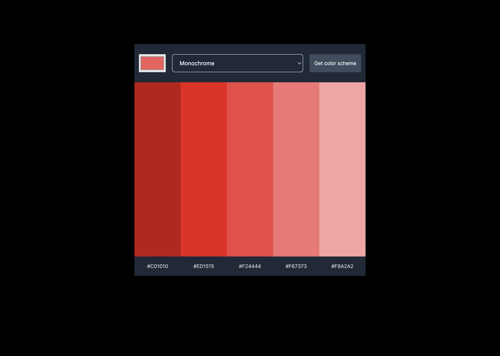

# Frontend Mentor - GitHub user search app solution

This is a solution to the [GitHub user search app challenge on Frontend Mentor](https://www.frontendmentor.io/challenges/github-user-search-app-Q09YOgaH6). Frontend Mentor challenges help you improve your coding skills by building realistic projects.

## Table of contents

- [Overview](#overview)
  - [The challenge](#the-challenge)
  - [Screenshot](#screenshot)
  - [Links](#links)
- [My process](#my-process)
  - [Built with](#built-with)
  - [What I learned](#what-i-learned)
  - [Continued development](#continued-development)
  - [Useful resources](#useful-resources)
- [Author](#author)
- [Acknowledgments](#acknowledgments)

## Overview

### The challenge

Users should be able to:

- View the optimal layout for the app depending on their device's screen size
- Get color scheme on button click

### Screenshot

### Links

- Live Site URL: [https://optimistic-williams-35d1ee.netlify.app/](https://optimistic-williams-35d1ee.netlify.app/)

## My process

### Built with

- Semantic HTML5 markup
- CSS custom properties
- Mobile-first workflow
- JavaScript

### What I learned

This challenge further ingrained the fundamentals of using HTML, CSS and Javascript

### Continued development

I really need to focus on how to write cleaner jS.

### Useful resources

- [YouTube](https://www.youtube.com) - YouTube is always open and it's really easy to learn how other people approach code.

## Author

- Website - [Manuel Pena](https://www.mannydevelops.com/)
- Twitter - [@manolobrown](https://www.twitter.com/manolobrown)
